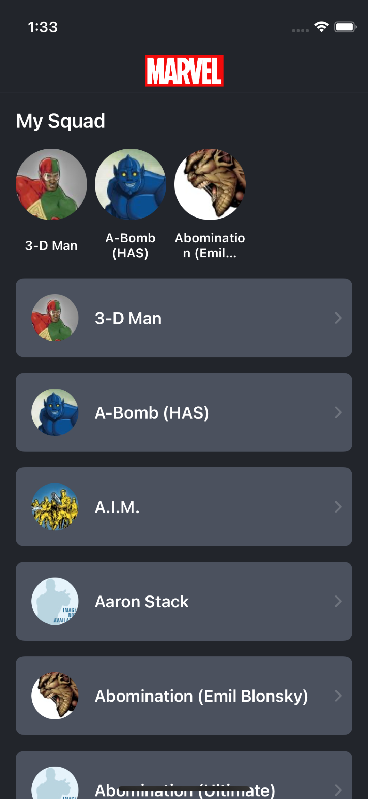
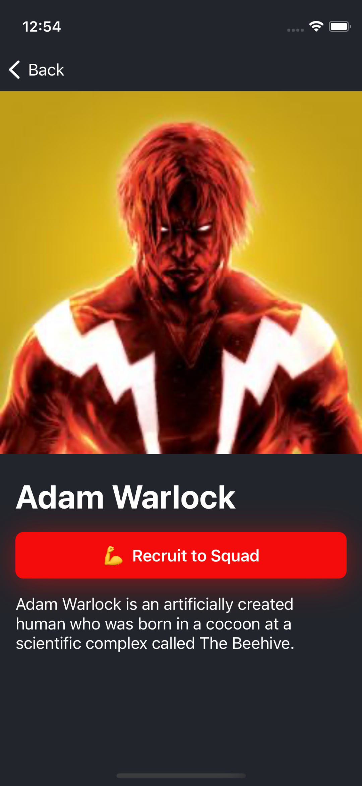

# TaskForce

TaskForce is a small app that gives you opportunity to assemble your own squad of Marvel Characters.

## Screenshots
<table>
  <tr>
    <td>Main Screen</td>
    <td>Character Details</td>
  </tr>
  <tr>
    <td></td>
    <td></td>
  </tr>
 </table>

## Features
* Communication with REST API via URLSession
* Persistence is implemented with Core Data
* Combine based MVVM architecture
* Localization
* Assets generation with SwiftGen

## Requirements

* Xcode 13+
* [brew](https://brew.sh)
* [Marvel API](https://developer.marvel.com/) `private key` and `public key`

### Note

To use the Marvel API you need to sign up for a developer account. Once you sign up you will find your API keys in the Account section.

It's important to add "*" as an Authorized Referrer in the Account section.

## Installation

* Clone the project
* Open terminal and navigate to project directory
* Run `chmod +x ./install.sh`
* Run `./install.sh`
* Script will ask you to enter your MARVEL API `public key` and `private key`, to add them to `Credentials.plist` which is ignored by `git`
* Open `TaskForce.xcodeproj`
* Wait till SPM dependencies are downloaded
* Run!

## Compatibility

This project is written in Swift 5.5 and requires Xcode 13 or newer to build and run.

TaskForce is compatible with iOS 14.0+.

## Things to do/improve

- [ ] Add Persistence Tests
- [ ] Add ViewModel Tests  
- [ ] Add UITests
- [ ] Add SwiftUI version
- [ ] Remove Kingfisher

## License

Copyright 2022 Igor Kokoev.

Licensed under MIT License: https://opensource.org/licenses/MIT